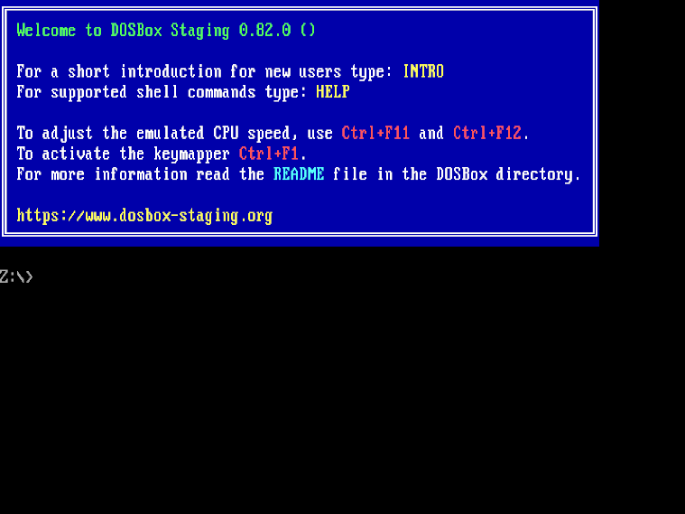

# King's Quest - DOSBox Staging Guide

[King's Quest](https://en.wikipedia.org/wiki/King%27s_Quest) is a series of adventure games developed by [Sierra On-Line](https://en.wikipedia.org/wiki/Sierra_Entertainment). This guide walks through copying, configuring, and running King's Quest 1 (SCI remake) through King's Quest 6 with [DOSBox Staging](https://www.dosbox-staging.org/).

> The original AGI version of King's Quest 1 (1984) is not covered here; this guide uses the 1990 SCI remake (`kq1sci`). King's Quest 7 and 8 are not DOS games and need to be installed and configured differently.

## Prerequisites

Follow the steps in the [prerequisites guide](../../docs/prerequisites.md) to install the software required to complete the game guides.

> `innoextract` is not needed for this collection — game files come from a Steam install rather than a GOG offline installer, so there is nothing to extract.

## Obtaining the game files

The King's Quest games covered here are available on Steam in two bundles:

- [King's Quest 1+2+3](https://store.steampowered.com/app/10100) — includes the SCI remake of KQ1 (1990), the AGI original of KQ2 (1985), and the AGI original of KQ3 (1986)
- [King's Quest 4+5+6](https://store.steampowered.com/app/10110) — includes KQ4 SCI (1988), KQ5 (1990), and KQ6 (1992)

Purchase and install both bundles via Steam. Steam will install them as ready-to-run game folders, not as DOS installers, so the workflow is to copy the DOS game files out of the Steam install directory into this repo's [games](games) directory.

### Locating the Steam install directory

On Linux, Steam typically installs games under one of:

- `~/.steam/steam/steamapps/common/`
- `~/.local/share/Steam/steamapps/common/`

Each bundle installs to a folder such as `Kings Quest 1+2+3/` or `Kings Quest 4+5+6/`. Inside each you'll find one subfolder per game.

### Copying game files into the repo

Copy the contents of each game's Steam folder into the matching folder under this repo's [games](games) directory, using the folder names below. The DOSBox configs and run scripts depend on these exact names:

- King's Quest 1 (SCI remake) => `games/kq1sci/`
- King's Quest 2 => `games/kq2/`
- King's Quest 3 => `games/kq3/`
- King's Quest 4 (SCI) => `games/kq4/`
- King's Quest 5 => `games/kq5/`
- King's Quest 6 => `games/kq6/`

> The exact path of the DOS files inside the Steam folder varies by game — some Steam packages put them at the top level, others bury them in a subfolder. Check that the destination ends up containing the game's `.EXE`/`.COM` launcher and resource files directly (e.g. `games/kq5/SCIKQ5.EXE`, not `games/kq5/somesubfolder/SCIKQ5.EXE`).

### Copying game files to ~/games

The run scripts mount games from `~/games/<game>`. Once you have populated `games/` from Steam, use the [copy-games](scripts/copy-games.sh) script to mirror the game folders into `~/games/`:

```bash
cd scripts/

# make the `copy-games` script executable
chmod +x ./copy-games.sh
# copy each game's files into ~/games/<game>
./copy-games.sh
```

The script skips any destination that already exists. Pass `-f` (or `--force`) to overwrite and start from a fresh copy if you've re-pulled the files from Steam.

## Installation

Steam-installed King's Quest files typically arrive with `RESOURCE.CFG` (SCI games) or driver settings (AGI games) already populated for software MIDI and SoundBlaster. In most cases no in-DOSBox installer needs to be run — the run scripts in the [Running the games](#running-the-games) section will launch each game directly.

If music or sound is missing or distorted for a specific game, you can drop into the game's directory inside DOSBox Staging and re-run its sound configuration tool. The per-game subsections below capture any game-specific configuration steps; they are intentionally light because the Steam install does most of the work.

```bash
flatpak run io.github.dosbox-staging
```



> All following commands in the section will be run in the context of DOSBox Staging.

### Mount /games directory

This step assumes you ran `./copy-games.sh` in the previous section so the game directories live under `~/games/`.

```dos
mount c ~/games

c:
```

### King's Quest I: Quest for the Crown (SCI remake)

The Steam version ships the 1990 SCI remake, launched via `SCIV.EXE`. Driver configuration is in `RESOURCE.CFG` and is usually fine out of the box. If you need to reconfigure, run the bundled configuration utility:

```dos
cd kq1sci

install.exe
```


- Select `General MIDI` for music if you want FluidSynth-routed music, or `AdLib` for OPL synthesis only.
- Select `Sound Blaster` for sound effects.

### King's Quest II: Romancing the Throne

KQ2 is an AGI game launched via `SIERRA.COM`. The Steam package ships pre-configured for AdLib music and PC speaker fallback. There is no separate installer; the configuration is stored in driver `.OVL` files alongside the game.

> AGI games do not use the MIDI device (`midiconfig=128:0`) — they output through AdLib/Tandy/PC speaker. The run script still starts FluidSynth for consistency with the other scripts in this folder; it does no harm if no MIDI traffic reaches it.


### King's Quest III: To Heir Is Human

KQ3 is also an AGI game launched via `SIERRA.COM` and follows the same configuration model as KQ2.


### King's Quest IV: The Perils of Rosella (SCI)

KQ4 ships the SCI version (1988) on Steam, launched via `SCIV.EXE`. As with KQ1 SCI, audio drivers are configured in `RESOURCE.CFG`. Re-run the in-game configuration utility if music or sound output is wrong:

```dos
cd ../kq4

install.exe
```


- Select `General MIDI` for music routed to FluidSynth.
- Select `Sound Blaster` for sound effects.

### King's Quest V: Absence Makes the Heart Go Yonder!

KQ5 is launched via `SCIKQ5.EXE`. The Steam package ships the CD-ROM edition; both DOS and Windows files are present in the install, but the DOSBox config mounts and launches the DOS executable only.

```dos
cd ../kq5

install.exe
```


- Select `General MIDI` for the best music quality (FluidSynth provides the General MIDI synth).
- Select `Sound Blaster Pro` or `Sound Blaster 16` for digital audio and speech.

### King's Quest VI: Heir Today, Gone Tomorrow

KQ6 is launched via `DOKQ6.EXE` (the DOS-mode executable; Windows files in the Steam install are ignored). The Steam package includes the CD-ROM edition with voice acting.

```dos
cd ../kq6

install.exe
```


- Select `General MIDI` for music.
- Select `Sound Blaster 16` for digital audio and speech.

## Configuration

Each game has its own [config](config) file. The configs diverge from [`config/default-dosbox-staging.conf`](../../config/default-dosbox-staging.conf) deliberately — cycles are tuned per engine era, the [autoexec] section mounts and launches each game, and MIDI is routed to FluidSynth via `midiconfig=128:0`.

Starting cycle values are picked to roughly match each game's target hardware. If a game runs too fast (action sequences are unplayable) or too slow (music stutters), edit the `cycles=fixed N` line in the relevant config:

| Game | Engine | Starting cycles |
|------|--------|-----------------|
| kq1sci | SCI0 | 5000 |
| kq2 | AGI | 1500 |
| kq3 | AGI | 1500 |
| kq4 | SCI0 | 5000 |
| kq5 | SCI1 | 6000 |
| kq6 | SCI1.1 | 8000 |

## Running the games

Each game has a launch script in [scripts](scripts) that starts FluidSynth (so MIDI works), then launches DOSBox Staging with the matching per-game config. The config's `[autoexec]` section auto-mounts `~/games/<game>` as `c:` and runs the game executable, so no manual `mount` or `cd` is needed inside DOSBox.

```bash
cd scripts/

# make the run scripts executable (only needed once)
chmod +x ./*-run.sh

# launch a game
./kq1sci-run.sh
./kq2-run.sh
./kq3-run.sh
./kq4-run.sh
./kq5-run.sh
./kq6-run.sh
```

The run scripts expect the games to live at `~/games/<game>`. Run `./copy-games.sh` once after populating `games/` from Steam (see [Copying game files to ~/games](#copying-game-files-to-games)) to put them there.
