# Quest for Glory Collection - DOSBox Staging Guide

[Quest for Glory](https://en.wikipedia.org/wiki/Quest_for_Glory) is a series of hybrid adventure/role-playing video games, which were designed by Corey and Lori Ann Cole for [Sierra Entertainment](https://en.wikipedia.org/wiki/Sierra_Entertainment).

This guide will walkthrough downloading, installing, and configuring Quest for Glory 1-4 with [DOSBox Staging](https://www.dosbox-staging.org/). 

> Quest for Glory 5 is not a DOS game and will need to be installed and configured differently.

## Prerequisites

Follow the steps in the [prerequisites guide](docs/prerequisites.md) to install the software required to complete the game guides.

## Downloading and extracting game files

Quest for Glory 1-5 can be purchased and downloaded via [GOG](https://www.gog.com/en/game/quest_for_glory). Once downloaded, the game installers will need to extracted with `innoextract`.

> For GOG installers, you will want to make sure you are downloading the files under the "Download Offline Backup Game Installers" and **not** the GOG Galaxy installer.

Once downloaded, you should have 5 installer files; one for each game in the series. We will now extract the game files from the installers using `innoextract`.

### Extracting games installers

The installer for Quest for Glory 1 includes versions of the game: the original, EGA, version of the game and the VGA remake.

In order to use the [extract-installers](scripts/extract-installers.sh) script, you will need to rename the installers to match the list below. Once the installers are renamed, they should be copied to the [installers](installers) directory.

- Quest for Glory 1 => qfg1.exe
- Quest for Glory 2 => qfg2.exe
- Quest for Glory 3 => qfg3.exe
- Quest for Glory 4 => qfg4.exe

Extract the game files with the following commands:

```bash
cd scripts/

# make the `extract-installers` script executable
chmod +x ./extract-installers.sh
# run the script
./extract-installers.sh
```

Once the script has finished running, the [games](games) directory should contain the extracted games files.

## Installation

We will now open DOSBox Staging to install the games. You can start DOSBox Staging by either pressing the `Super` key and searching for DOSBox Staging or by running the following command:

```bash
flatpak run io.github.dosbox-staging
```


> All following commands in the section will be run in the context of DOSBox Staging.

### Mount /games directory

The following command assumes you have cloned this repo into a `/projects` folder in your Home directory. If you cloned to a different location, updated the path, as needed.

```dos
mount c ~/projects/dos-game-installation-guides/question-for-glory-collection/games

c:
```

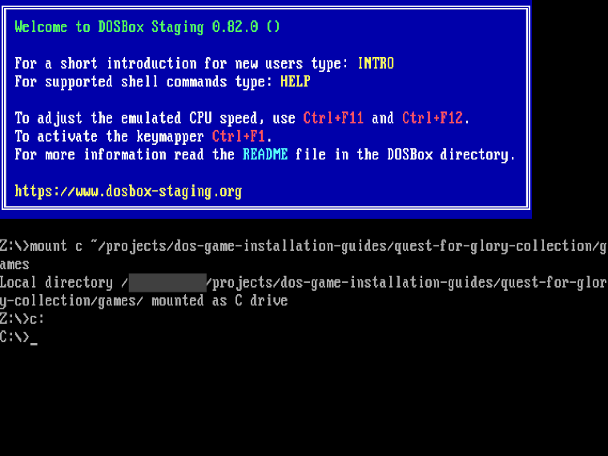

> Leave DOSBox Staging open to complete the installation steps for each game.

### Quest for Glory I: So You Want to Be a Hero

To install both the EGA (original) and VGA versions Quest for Glory 1, you will need to run the following commands in DOSBox Staging:

```dos
cd QFG1-EGA

install.exe
```

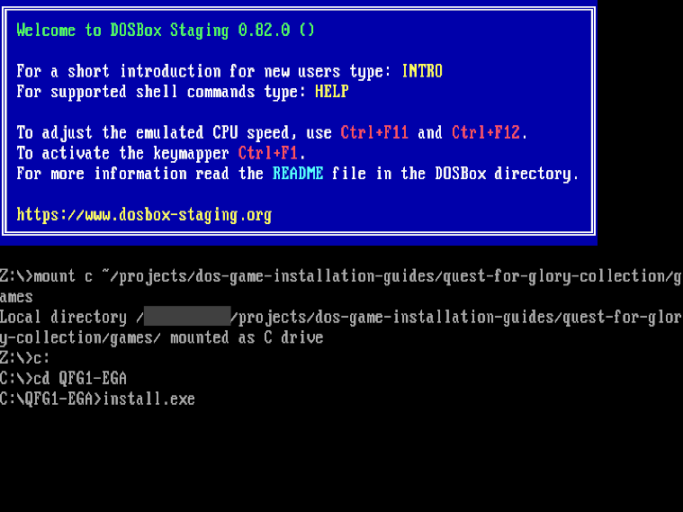

You are now in the installer for Quest for Glory 1 EGA.

> You can use your keyboard's arrow keys to make a selection and press the `ENTER` key to move to the next screen.

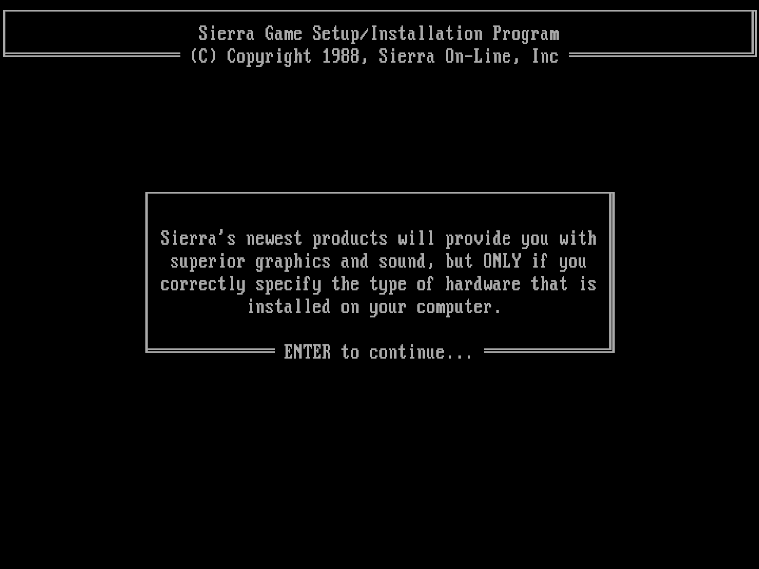

- On the next screen, select `EGA/VGA with RGB monitor - 16 colors` as it provides the best image quality for this game.

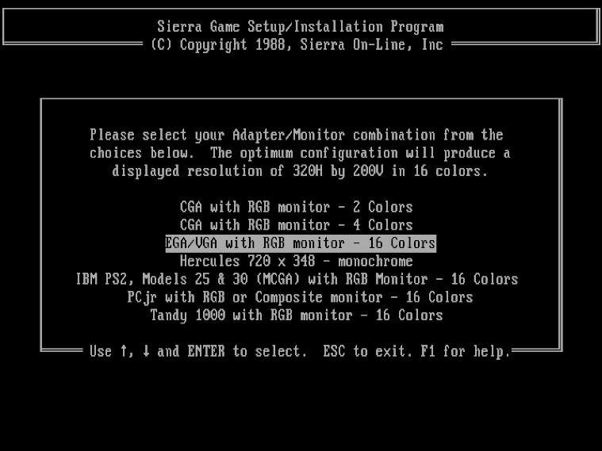

- Next you come to the sound settings. For the best sound, select `AdLib Music Synthesizer Card`.

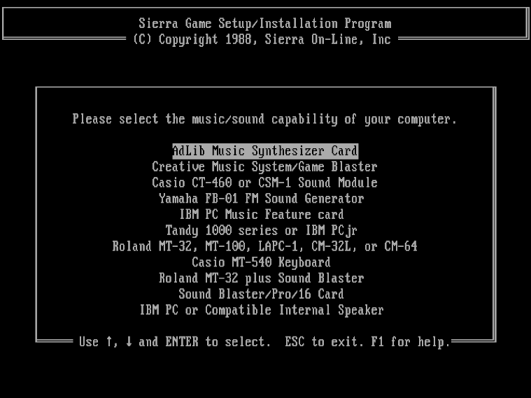

- On the next screen, select `IBM or IBM-compatible keyboard`.

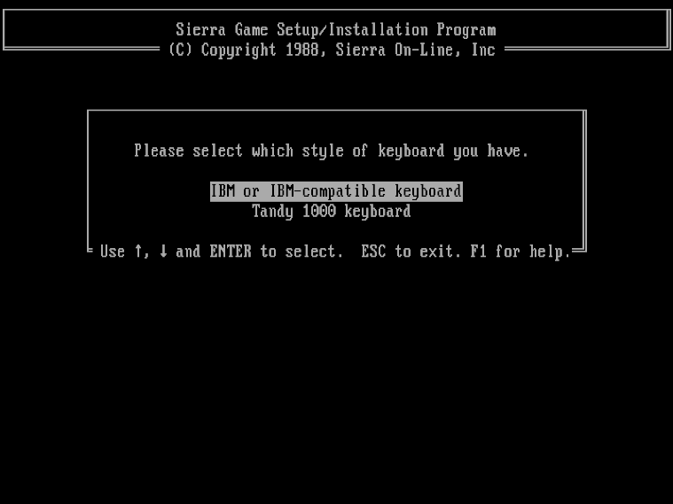

- This screen is informational and no selections are needed.

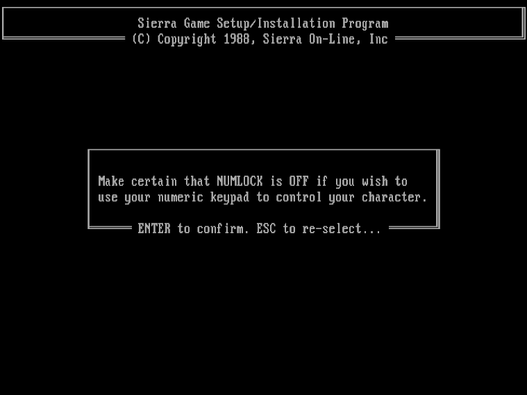

- You'll now be asked if you would like to use an IBM compatible joystick. Select `No`.

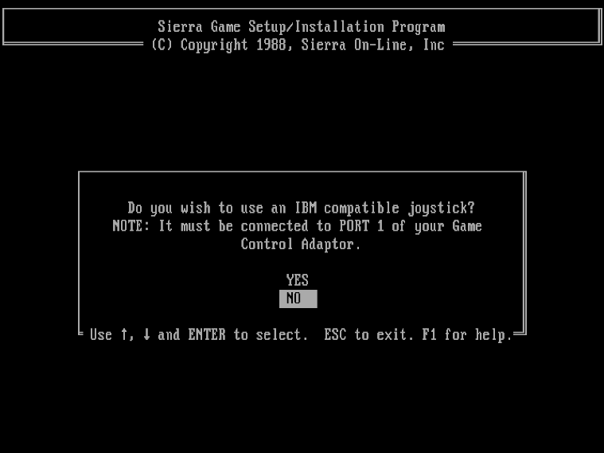

- On the next screen, select `YES` to use a Micosoft compatible mouse.

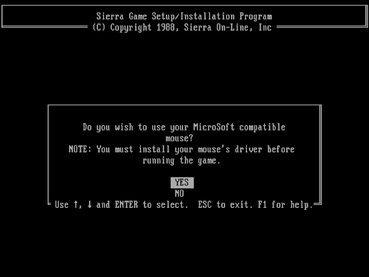

- The final screen will ask if you the game to your hard drive. Press `ESC` to decline and finish the installer.

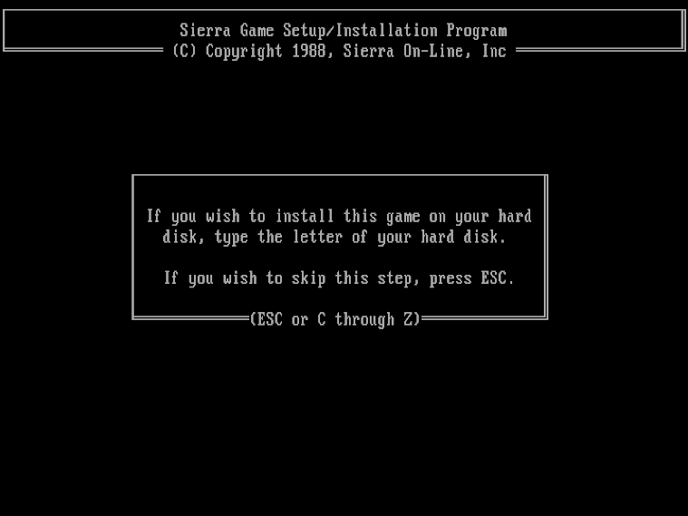

- The installation is now complete and you can continue on to installing the VGA version of Quest for Glory 1.

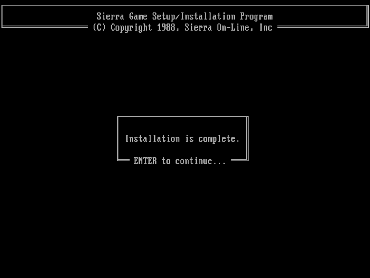

Next we will run the installer for the VGA version of Quest for Glory 1 by running the following commands in DOSBox Staging:

```dos
cd ../QFG1-VGA

install.exe
```

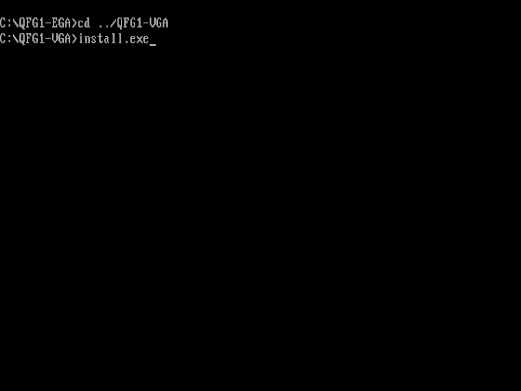

You are now in the installer for Quest for Glory 1 VGA.

> You can use your keyboard's arrow keys to make a selection and press the `ENTER` key to move to the next screen.

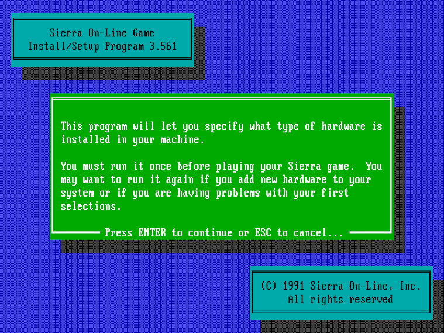

- On the next screen, ensure `Music` is set to `General MIDI Sound Driver` and `Speech` is set to `Soundblaster`. All other options can be left at the default selection.

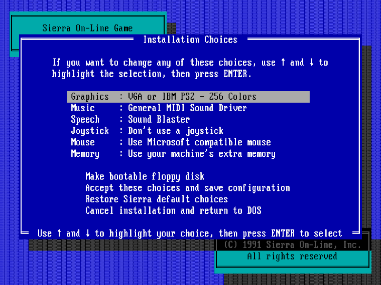

- Select `Accept these choices and save configuration` and press the `ENTER` key.
- The next two screens can be skipped by pressing the `ENTER` key.
- The installation is now complete.

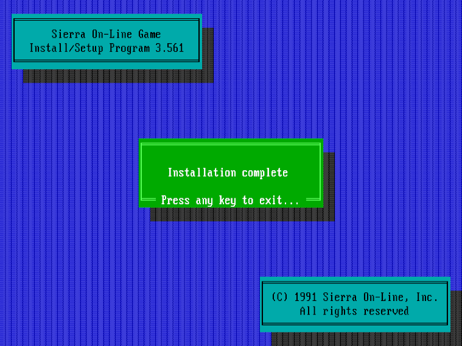

Installation for both versions of Quest for Glory 1 have been completed. You can now move on to installing Quest for Glory 2.

### Quest for Glory II: Trial By Fire

To install Quest for Glory 2, you will need to run the following commands in DOSBox Staging:

```dos
cd ../QFG2

inst.exe
```

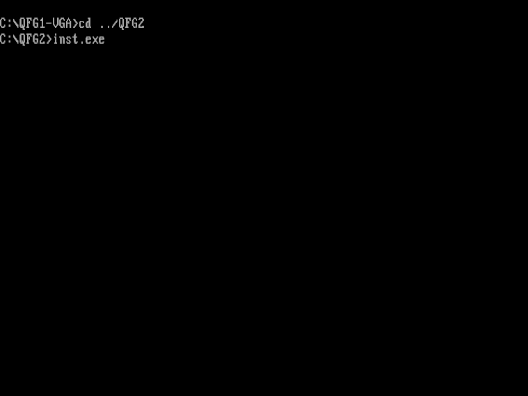

You are now in the installer for Quest for Glory 2.

> You can use your keyboard's arrow keys to make a selection and press the `ENTER` key to move to the next screen.


- On the next screen, select `EGA/VGA with RGB monitor - 16 colors` as it provides the best image quality for this game.


- Next you come to the sound settings. For the best sound, select `AdLib Music Synthesizer Card`.


- On the next screen, select `IBM or IBM-compatible keyboard`.


- This screen is informational and no selections are needed.


- You'll now be asked if you would like to use an IBM compatible joystick. Select `No`.


- On the next screen, select `YES` to use a Micosoft compatible mouse.


- The final screen will ask if you the game to your hard drive. Press `ESC` to decline and finish the installer.


Installation for Quest for Glory 2 have been completed. You can now move on to installing Quest for Glory 3.

### Quest for Glory III: Wages of War

### Quest for Glory IV: Shadows of Darkness

## Configuration

## Running the games
